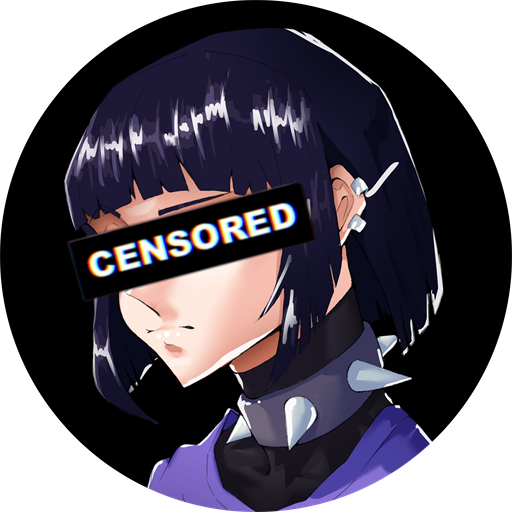

<div align="center">



# Sentrychan

**Your self-driving library for anime, manga and novels.**

Tell it what you follow — it finds, downloads, names and files every new episode
and chapter for you.

[](https://github.com/D4Ron/Sentrychan/releases/latest)
[](LICENSE)
[](https://d4ron.github.io/Sentrychan/)

</div>

---

## What it does

Sentrychan is a Windows desktop app that manages a media library end to end: it
watches RSS feeds for the series you follow, downloads new releases, renames and
files them into `Show / Season` folders your media server already understands, and
gives you a reader for everything that isn't video.

- **Auto-download episodes** — add a show, and new episodes arrive on their own,
  properly named and filed for Plex or Jellyfin. Set preferred release groups and
  it picks the right one when several publish the same episode.
- **Downloads, your way** — a built-in torrent engine (pause, resume, speed limits,
  queue), or point it at your own qBittorrent instance instead.
- **Read manga and novels in-app** *(beta)* — paged or webtoon scroll, online or
  downloaded for offline, with reading progress tracked. Already have chapters on
  disk? Point it at the folder and read those too.
- **Stay current** — a background monitor checks for new episodes and chapters and
  raises a Windows notification when they land.
- **Discover** — browse the current season, follow anime news, and see a live feed
  of new releases with seeds and size.
- **Anime quiz and OP Battle Royale** — guess the show from its opening, solo or
  last-one-standing.
- **Tidy a messy library** — import your MyAnimeList watching list, fill gaps in
  series you already own, and resolve files the matcher couldn't place.
- **Make it yours** — four themes (Yoru, Shiro, Sakura, Neon), sidebar or top-bar
  layout, custom background image.

## Install

Grab the installer from the [latest release](https://github.com/D4Ron/Sentrychan/releases/latest).
No account, no .NET to install — everything is bundled, and the app updates itself
from then on.

> **Windows may warn you the first time.** Sentrychan isn't code-signed yet, so
> SmartScreen may show a blue "Windows protected your PC" screen on first launch.
> Click **More info → Run anyway**.

## Manga and novels are in beta

The anime side is the mature half of Sentrychan. Manga and novel support — library,
reader, offline downloads and progress tracking — works, but it is newer and rougher,
and odd chapter numbering or an unusual source layout can still trip it up.

Feedback on it is genuinely wanted. Open an
[issue](https://github.com/D4Ron/Sentrychan/issues) and include the series and source
if you can; that's usually enough to reproduce a problem.

## About online sources

**Sentrychan ships with no online sources built in.** Out of the box it is a
library manager, downloader and reader. It does not include, host or bundle any
scraper for a manga or anime site, and it is not affiliated with any of them.

Online sources come from **source packs** — separate, third-party plug-in DLLs you
import yourself from `Settings → Library & Danger → Import source pack`. They load
on the next restart. This repository neither distributes nor links to them.

Everything else works without any of that: your existing files, your own folders of
chapter images, RSS feeds you add, MyAnimeList import, the reader, the quiz and
watch parties.

## On the way

Sentrychan today is entirely local — there is nothing to sign up for, and the app
never talks to a server of ours. These are being built but are **not in the app yet**:

- **Watch parties** — watch together in a shared room, in sync, without passing files
  around. Each room runs on a hosted machine, so this is the one feature that costs
  real money per hour of use.
- **Cloud sync, friends and activity** — one library across machines, plus realtime
  airing alerts.

Because they need a hosted backend, they'll arrive as supporter features. Everything
currently in the app stays free.

There will always be an escape hatch: point the app at your own
[Supabase](https://supabase.com) project, apply [`supabase/schema.sql`](supabase/schema.sql),
and the same features run against your own backend for nothing.

> **Note for contributors:** `IHyperbeamService` is registered in DI but no view-model
> consumes it yet, and `HyperbeamConfig.ApiKey` ships as a placeholder. A real Hyperbeam
> key is a server secret that authorises billable VM creation — it must never be committed
> or compiled into a client build. Before watch parties ship, that call moves behind a
> Supabase Edge Function.

## Building from source

Requires the [.NET 9 SDK](https://dotnet.microsoft.com/download).

```powershell
git clone https://github.com/D4Ron/Sentrychan.git
cd Sentrychan
dotnet build Sentrychan.sln
dotnet run --project Sentrychan.App
```

### Project layout

| Project | Role |
| --- | --- |
| `Sentrychan.Core` | Services, EF Core (SQLite), models, interfaces. No UI dependencies. |
| `Sentrychan.UI` | Avalonia 11 views and ReactiveUI view-models. |
| `Sentrychan.App` | Composition root, DI wiring, plugin loading. |
| `Sentrychan.Sources` | Optional source-pack plug-in, loaded by reflection at runtime. |

`Sentrychan.App` references `Sentrychan.Sources` with `ReferenceOutputAssembly="false"`,
so no source types are ever compiled into the shipped binary. Build a source-less
client with:

```powershell
dotnet publish Sentrychan.App -p:IncludeSources=false
```

Local state lives in `%APPDATA%\Sentrychan\` — the SQLite database, logs, image
cache and imported source packs.

## Contributing

Issues and pull requests are welcome. A few things worth knowing before you start:

- The source-pack separation is deliberate and load-bearing. Please don't compile
  sources into the client.
- `Series` (anime, episodes) and `Manga` (chapters, reading progress) are
  deliberately separate models. Novels are `Manga` with `IsNovel = true`.
- Comments explain **why**, not what. Match the density of the code around them.

## License

[GNU Affero General Public License v3.0](LICENSE).

If you run a modified version of Sentrychan as a network service, the AGPL requires
you to offer that modified source to its users.

## Acknowledgements

Built with [Avalonia](https://avaloniaui.net/), [MonoTorrent](https://github.com/alanmcgovern/monotorrent),
[ReactiveUI](https://www.reactiveui.net/) and [Velopack](https://velopack.io/).
Metadata from [Jikan](https://jikan.moe/) (MyAnimeList),
[AnitomySharp](https://github.com/tabratton/AnitomySharp) and the
[anime-offline-database](https://github.com/manami-project/anime-offline-database).

---

<div align="center">
<sub>

Sentrychan is a library manager and download client. It bundles no online sources
and hosts no content. You are responsible for what you download and for complying
with the laws that apply to you.

</sub>
</div>
